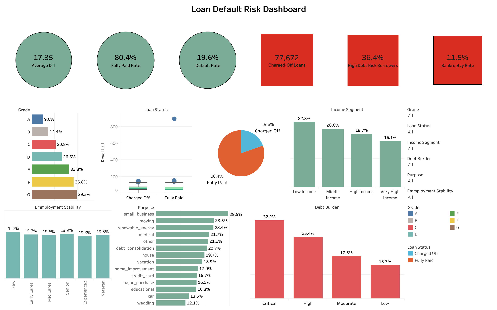
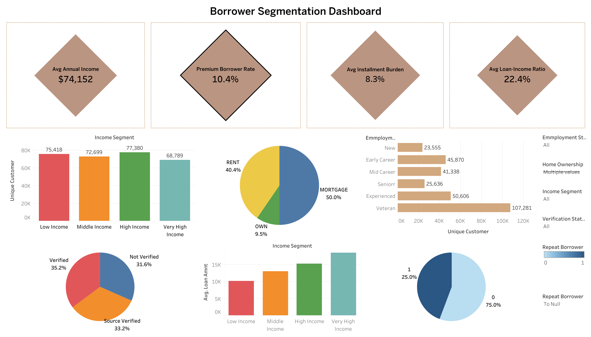
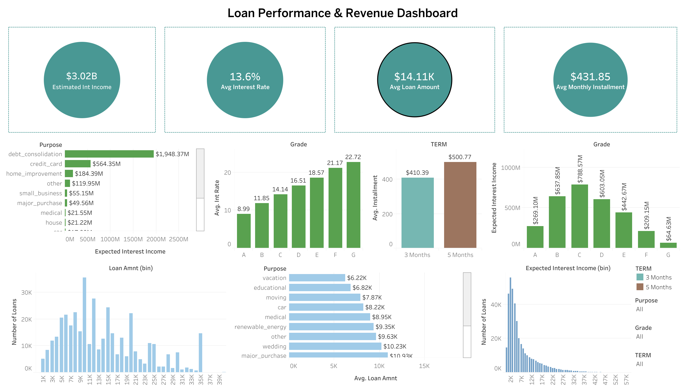
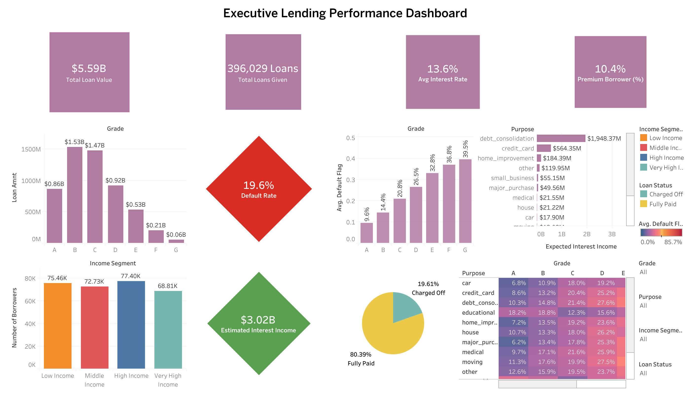

# 📊 Loan Credit Risk Analytics & Lending Portfolio Intelligence
Leveraging Data Analytics and Business Intelligence to Improve Credit Risk Assessment, Portfolio Performance, and Strategic Lending Decisions

## Executive Summary

Financial institutions process thousands of loan applications daily, yet transforming lending data into actionable business intelligence remains a major challenge. Poor lending decisions can increase default rates, reduce profitability, and weaken the overall quality of a loan portfolio.

This project presents an end-to-end Loan Credit Risk Analytics solution developed using Python for data preparation, exploratory data analysis (EDA), feature engineering, and KPI development, while Tableau is used to build interactive executive dashboards for business decision-making.

Rather than focusing solely on statistical analysis, this project demonstrates how data analytics can be applied to solve real business problems in the financial services industry. The analysis identifies key drivers of loan default, evaluates borrower characteristics, measures lending performance, and provides strategic recommendations that support informed credit decisions and portfolio optimization.

## Business Problem

Financial institutions must continuously balance portfolio growth with credit risk management. While issuing more loans can increase revenue, poor lending decisions often lead to higher default rates, reduced profitability, and increased financial exposure.

Business stakeholders require reliable insights to answer critical questions such as:

- Which borrowers are most likely to default?
- Which customer segments generate the greatest profitability?
- Which loan grades contribute the highest financial risk?
- Which loan purposes generate the highest expected returns?
-  How can lending policies improve portfolio quality while minimizing credit losses?

This project addresses these questions by transforming raw lending data into actionable business intelligence that supports strategic lending decisions.

## Project Objectives

The primary objectives of this project are to:

- Analyze the overall health and performance of the loan portfolio.
- Identify the key factors influencing borrower default.
- Engineer business-focused features for enhanced credit risk analysis.
- Develop meaningful Key Performance Indicators (KPIs) for portfolio monitoring.
- Segment borrowers according to financial characteristics and repayment behaviour.
- Evaluate portfolio profitability across loan products and customer segments.
- Design interactive Tableau dashboards for executive reporting.
- Generate actionable recommendations to improve lending performance and reduce credit risk.

## Business Questions Answered

This analysis provides answers to several important business questions:

- What is the overall loan default rate?
- Which credit grades exhibit the highest probability of default?
- Which borrower segments present the highest financial risk?
- Which loan purposes generate the greatest expected interest income?
- How do borrower income and debt burden influence repayment behaviour?
- Which customer segments contribute most to portfolio value?
- What strategic actions can improve lending performance while reducing portfolio risk?

## Solution Approach

The project followed a structured end-to-end analytics workflow:

- Data Collection
- Data Cleaning and Validation
- Exploratory Data Analysis (EDA)
- Feature Engineering
- KPI Development
- Business Intelligence Analysis
- Tableau Dashboard Development
- Business Insights and Strategic Recommendations

## Tools & Technologies

| Category | Technologies |
|:----------|:-------------|
| **Programming Language** | Python |
| **Data Analysis** | Pandas, NumPy |
| **Data Visualization** | Matplotlib, Seaborn |
| **Business Intelligence** | Tableau |
| **Development Environment** | Jupyter Notebook |
| **Version Control** | Git & GitHub |

## Dashboard Gallery

### 1️⃣ Executive Loan Portfolio Overview
Provides a high-level overview of the lending portfolio, including portfolio value, borrower distribution, expected interest income, loan composition, and overall lending performance.


### 2️⃣ Loan Default Risk Dashboard

Analyzes borrower default behaviour across loan grades, debt burden categories, income segments, and loan purposes to identify the primary drivers of credit risk.



### 3️⃣ Borrower Segmentation Dashboard

Explores borrower demographics, employment stability, income groups, home ownership, verification status, and repeat borrowing behaviour to better understand customer profiles.



### 4️⃣ Loan Performance & Revenue Dashboard

Evaluates lending profitability through loan value, expected interest income, interest rates, installment analysis, and portfolio growth.



### 5️⃣ Executive Lending Performance Dashboard

Provides an executive summary of key lending KPIs, portfolio composition, financial performance, and strategic business indicators.



## Tableau Dashboards

| Dashboard | View |
|-----------|------|
| Executive Loan Portfolio Overview | [Open Dashboard](https://surl.li/czdocv) |
| Loan Default Risk Dashboard | [Open Dashboard](https://surl.li/vntsxm) |
| Borrower Segmentation Dashboard | [Open Dashboard](https://surl.lt/shnnky) |
| Loan Performance & Revenue Dashboard | [Open Dashboard](https://surli.cc/xfyjya) |
| Executive Lending Performance Dashboard | [Open Dashboard](https://surl.li/dqvjes) |

## 📈 Key Business Insights
- Approximately 80% of issued loans were successfully repaid, while 20% were charged off.
- Loan Grade emerged as one of the strongest predictors of borrower default.
- Borrowers with higher debt burdens exhibited significantly greater repayment risk.
- Debt Consolidation generated the largest share of expected interest income, making it the most profitable loan category.
- Higher-income borrowers accounted for the largest share of the overall portfolio value.
- Portfolio risk increased consistently from Grade A through Grade G, validating the institution's credit grading methodology.

## 💼 Business Recommendations

Based on the analytical findings, the following recommendations are proposed:

- Strengthen underwriting standards for higher-risk credit grades.
- Implement predictive early-warning systems for identifying high-risk borrowers.
- Expand lending opportunities for financially stable customer segments.
- Diversify lending across multiple loan purposes to reduce concentration risk.
- Adopt risk-based pricing strategies aligned with borrower credit profiles.
- Strengthen borrower verification and affordability assessments.
- Integrate executive dashboards into routine portfolio monitoring to support data-driven decision-making.

## 📌 Project Highlights

| **Metric** | **Value** |
|:-----------|:----------|
| 📁 **Loan Records Analyzed** | **396,029** |
| 👥 **Unique Borrowers** | **294,396** |
| 💰 **Portfolio Value** | **$5.59 Billion** |
| 📈 **Expected Interest Income** | **$3.02 Billion** |
| 📊 **Executive Dashboards** | **5 Interactive Tableau Dashboards** |
| 🛠️ **Engineered Features** | **12+ Features** |

## Skills Demonstrated

This project demonstrates practical experience across the complete data analytics lifecycle, including:

- Data Cleaning & Validation
- Exploratory Data Analysis (EDA)
- Feature Engineering
- KPI Development
- Credit Risk Analytics
- Financial Data Analysis
- Business Intelligence
- Tableau Dashboard Design
- Data Visualization
- Executive Reporting
- Data Storytelling
- Business Recommendation Development

## 📁 Repository Structure

```text
loan-credit-risk-analytics/
│
├── 📂 data/
│   └── 📄 Lending_club_loan.csv.zip         # Raw lending dataset
│
├── 📂 images/
│   ├── 🖼️ lending_portfolio_dashboard.png
│   ├── 🖼️ loan_default_risk_dashboard.png
│   ├── 🖼️ borrower_segmentation.png
│   ├── 🖼️ loan_performance_revenue_dashboard.png
│   └── 🖼️ executive_lending_performance.png
│
├── 📂 notebook/
│   └── 📓 Loan_Credit_Risk_Analytics.ipynb      # Complete Python analysis
│
├── 📄 README.md                                 # Project documentation
├── 📄 requirements.txt                          # Project dependencies
└── 📄 .gitignore                                # Git ignored files
```

## 🚀 Getting Started

Follow the steps below to set up and run this project locally.

### 1. Clone the Repository

```bash
git clone https://github.com/Esters-10/loan-credit-risk-analytics.git
```

### 2. Navigate to the Project Directory

```bash
cd loan-credit-risk-analytics
```

### 3. Install the Required Dependencies

```bash
pip install -r requirements.txt
```

### 4. Launch Jupyter Notebook

```bash
jupyter notebook
```

### 5. Open the Project Notebook

Navigate to:

```text
notebook/Loan_Credit_Risk_Analytics.ipynb
```

You can now run the notebook to reproduce the complete analytics workflow, including data preprocessing, exploratory data analysis (EDA), feature engineering, KPI development, and the insights used to build the accompanying Tableau dashboards.

## 👨‍💻 About the Author
Tomiwa Adisa

I am a Data Analyst passionate about transforming complex datasets into meaningful business intelligence that supports strategic decision-making. My interests span data analytics, business intelligence, financial analytics, and machine learning, with a strong focus on solving real-world business problems through data.

This project showcases my ability to manage the complete analytics lifecycle—from data preparation and feature engineering to executive dashboard development and business storytelling.

- GitHub: https://github.com/Esters-10
- LinkedIn: https://www.linkedin.com/in/adisatee15
