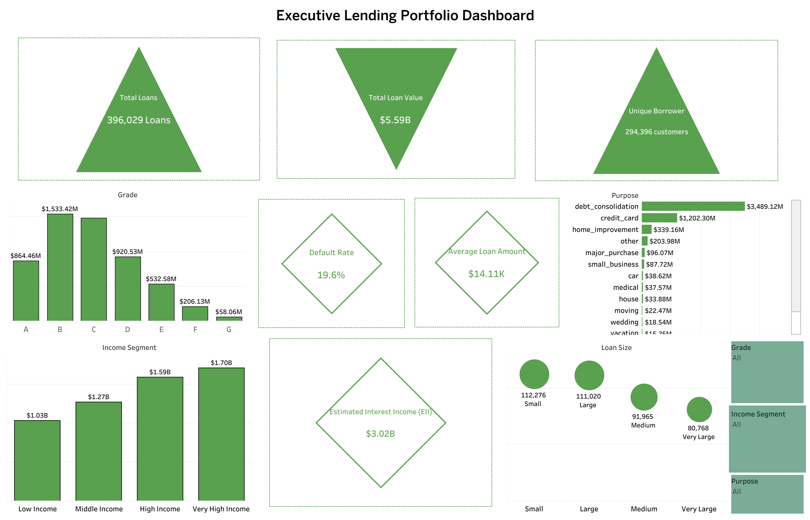

# 📊 Loan Credit Risk Analytics & Lending Portfolio Intelligence
### Leveraging Data Analytics and Business Intelligence to Improve Credit Risk Assessment, Portfolio Performance, and Strategic Lending Decisions

## Executive Summary

Financial institutions process thousands of loan applications daily, yet transforming lending data into actionable business intelligence remains a major challenge. Poor lending decisions can increase default rates, reduce profitability, and weaken the overall quality of a loan portfolio.

This project presents an end-to-end Loan Credit Risk Analytics solution developed using Python for data preparation, exploratory data analysis (EDA), feature engineering, and KPI development, while Tableau is used to build interactive executive dashboards for business decision-making.

Rather than focusing solely on statistical analysis, this project demonstrates how data analytics can be applied to solve real business problems in the financial services industry. The analysis identifies key drivers of loan default, evaluates borrower characteristics, measures lending performance, and provides strategic recommendations that support informed credit decisions and portfolio optimization.

## Business Problem

Financial institutions must continuously balance portfolio growth with credit risk management. While issuing more loans can increase revenue, poor lending decisions often lead to higher default rates, reduced profitability, and increased financial exposure.

Business stakeholders require reliable insights to answer critical questions such as:

- Which borrowers are most likely to default?
- Which customer segments generate the greatest profitability?
- Which loan grades contribute the highest financial risk?
- Which loan purposes generate the highest expected returns?
-  How can lending policies improve portfolio quality while minimizing credit losses?

This project addresses these questions by transforming raw lending data into actionable business intelligence that supports strategic lending decisions.

## Project Objectives

The primary objectives of this project are to:

- Analyze the overall health and performance of the loan portfolio.
- Identify the key factors influencing borrower default.
- Engineer business-focused features for enhanced credit risk analysis.
- Develop meaningful Key Performance Indicators (KPIs) for portfolio monitoring.
- Segment borrowers according to financial characteristics and repayment behaviour.
- Evaluate portfolio profitability across loan products and customer segments.
- Design interactive Tableau dashboards for executive reporting.
- Generate actionable recommendations to improve lending performance and reduce credit risk.

## Business Questions Answered

This analysis provides answers to several important business questions:

- What is the overall loan default rate?
- Which credit grades exhibit the highest probability of default?
- Which borrower segments present the highest financial risk?
- Which loan purposes generate the greatest expected interest income?
- How do borrower income and debt burden influence repayment behaviour?
- Which customer segments contribute most to portfolio value?
- What strategic actions can improve lending performance while reducing portfolio risk?

## Solution Approach

The project followed a structured end-to-end analytics workflow:

Data Collection
Data Cleaning and Validation
Exploratory Data Analysis (EDA)
Feature Engineering
KPI Development
Business Intelligence Analysis
Tableau Dashboard Development
Business Insights and Strategic Recommendations

## Solution Approach

The project followed a structured end-to-end analytics workflow:

- Data Collection
- Data Cleaning and Validation
- Exploratory Data Analysis (EDA)
- Feature Engineering
- KPI Development
- Business Intelligence Analysis
- Tableau Dashboard Development
- Business Insights and Strategic Recommendations

## Tools & Technologies

| Category | Technologies |
|:----------|:-------------|
| **Programming Language** | Python |
| **Data Analysis** | Pandas, NumPy |
| **Data Visualization** | Matplotlib, Seaborn |
| **Business Intelligence** | Tableau |
| **Development Environment** | Jupyter Notebook |
| **Version Control** | Git & GitHub |

## Dashboard Gallery

### 1️⃣ Executive Loan Portfolio Overview
Provides a high-level overview of the lending portfolio, including portfolio value, borrower distribution, expected interest income, loan composition, and overall lending performance.

### 2️⃣ Loan Default Risk Dashboard

Analyzes borrower default behaviour across loan grades, debt burden categories, income segments, and loan purposes to identify the primary drivers of credit risk.

### 3️⃣ Borrower Segmentation Dashboard

Explores borrower demographics, employment stability, income groups, home ownership, verification status, and repeat borrowing behaviour to better understand customer profiles.

### 4️⃣ Loan Performance & Revenue Dashboard

Evaluates lending profitability through loan value, expected interest income, interest rates, installment analysis, and portfolio growth.

### 5️⃣ Executive Lending Performance Dashboard

Provides an executive summary of key lending KPIs, portfolio composition, financial performance, and strategic business indicators.

## Repository Structure

loan-credit-risk-analytics/
│
├── data/
│   └── Loan_Credit_Risk_Dataset.csv
│
├── images/
│   ├── executive_loan_portfolio_overview.png
│   ├── loan_default_risk_dashboard.png
│   ├── borrower_segmentation_dashboard.png
│   ├── loan_performance_revenue_dashboard.png
│   └── executive_lending_performance_dashboard.png
│
├── notebook/
│   └── Loan_Credit_Risk_Analytics.ipynb
│
├── README.md
├── requirements.txt
└── .gitignore
